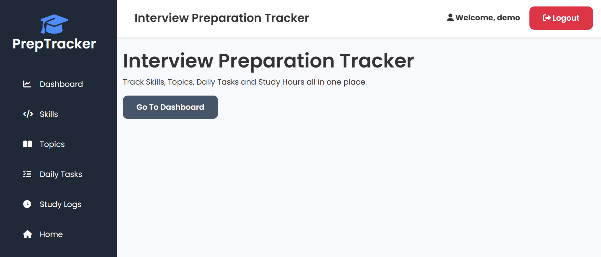
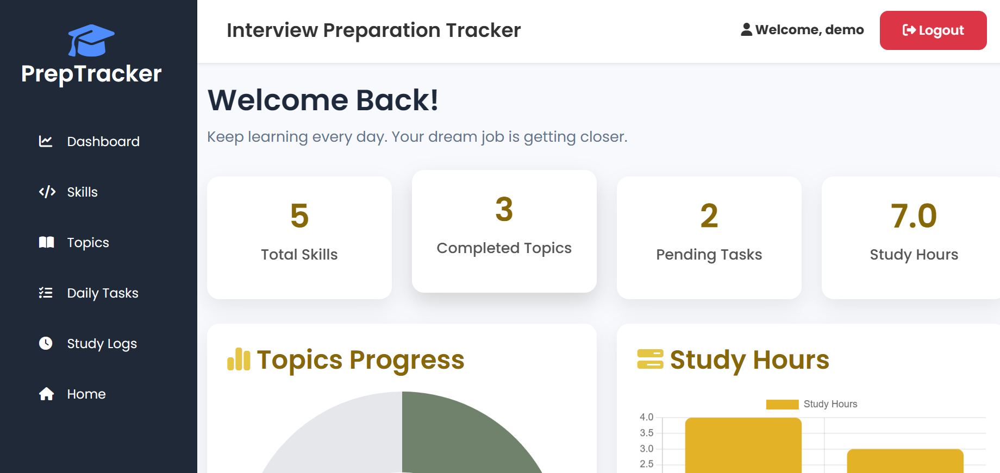
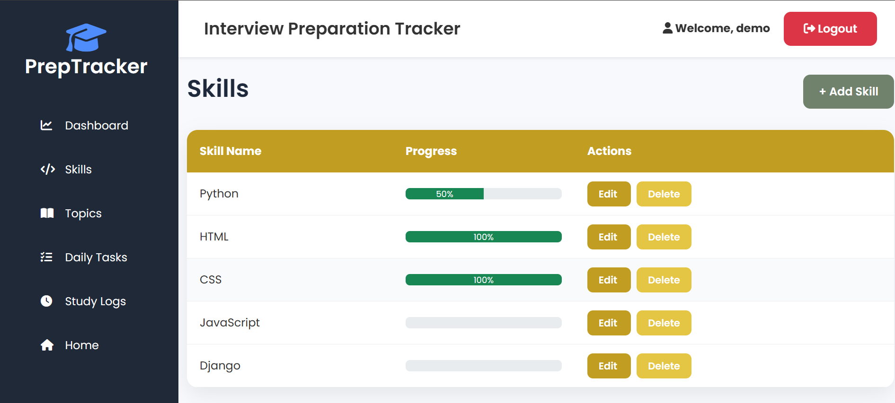
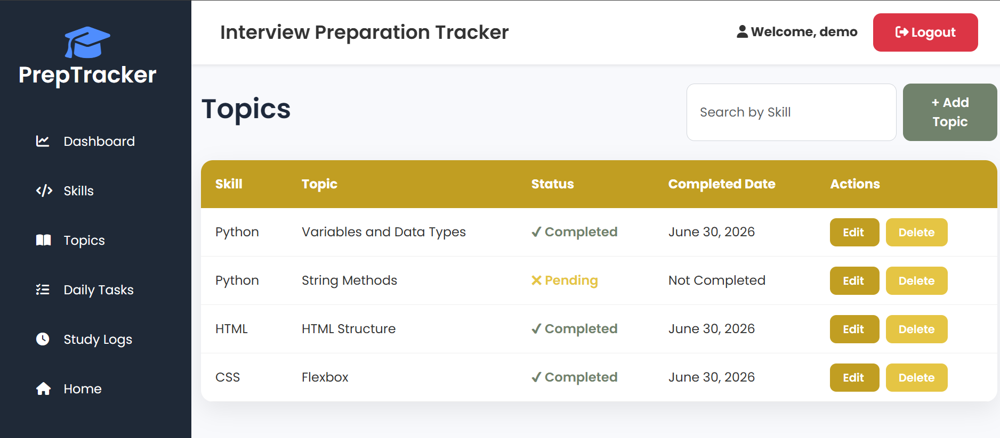
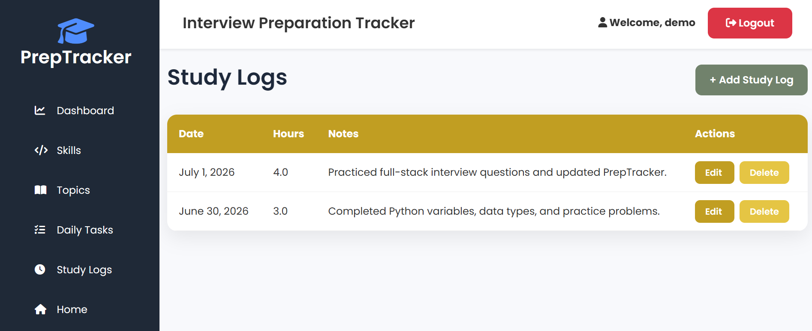

# 🎯 PrepTracker - Interview Preparation Tracker

PrepTracker is a full-stack Django web application designed to help students organize and track their interview preparation. It allows users to manage skills, topics, daily tasks, and study logs while monitoring their overall learning progress through an interactive dashboard.

---

## 🌐 Live Demo

🔗 https://preptracker-1-qisr.onrender.com/

---

## ✨ Features

- 👤 User Registration & Login Authentication
- 📚 Skill Management
- 📝 Topic Tracking
- ✅ Daily Task Management
- ⏱️ Study Log Tracking
- 📊 Dashboard with Progress Analytics
- 📅 Calendar Integration
- 🔍 Search & Filter Functionality
- 📱 Responsive User Interface
- 🔐 Secure User-specific Data

---

## 🛠️ Tech Stack

### Backend
- Python
- Django

### Frontend
- HTML5
- CSS3
- Bootstrap 5
- JavaScript

### Database
- SQLite

### Deployment
- Render

### Version Control
- Git
- GitHub

---

## 📂 Project Structure

```text
PrepTracker/
│
├── accounts/
├── config/
├── tracker/
├── manage.py
├── requirements.txt
└── README.md
```

---

## 🚀 Installation

### Clone the repository

```bash
git clone https://github.com/bhaktialappanavar/PrepTracker.git
```

### Navigate into the project

```bash
cd PrepTracker
```

### Create a virtual environment

```bash
python -m venv venv
```

### Activate the virtual environment

Windows

```bash
venv\Scripts\activate
```

Mac/Linux

```bash
source venv/bin/activate
```

### Install dependencies

```bash
pip install -r requirements.txt
```

### Apply migrations

```bash
python manage.py migrate
```

### Run the development server

```bash
python manage.py runserver
```

Visit:

```
http://127.0.0.1:8000/
```

---

## 📸 Screenshots

### Home Page



### Dashboard



### Skills



### Topics



### Daily Tasks


### Study Logs



---

## 📈 Future Improvements

- Email reminders for pending tasks
- Interview question repository
- Notes section
- Export progress reports (PDF/Excel)
- Dark Mode
- PostgreSQL support

---

## 👨‍💻 Author

**Bhakti Alappanavar**

GitHub: https://github.com/bhaktialappanavar

---

## 📄 License

This project is developed for educational purposes as a personal portfolio.
